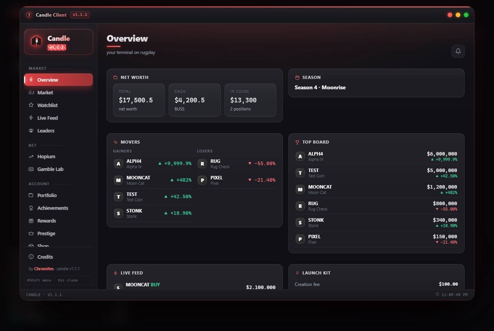
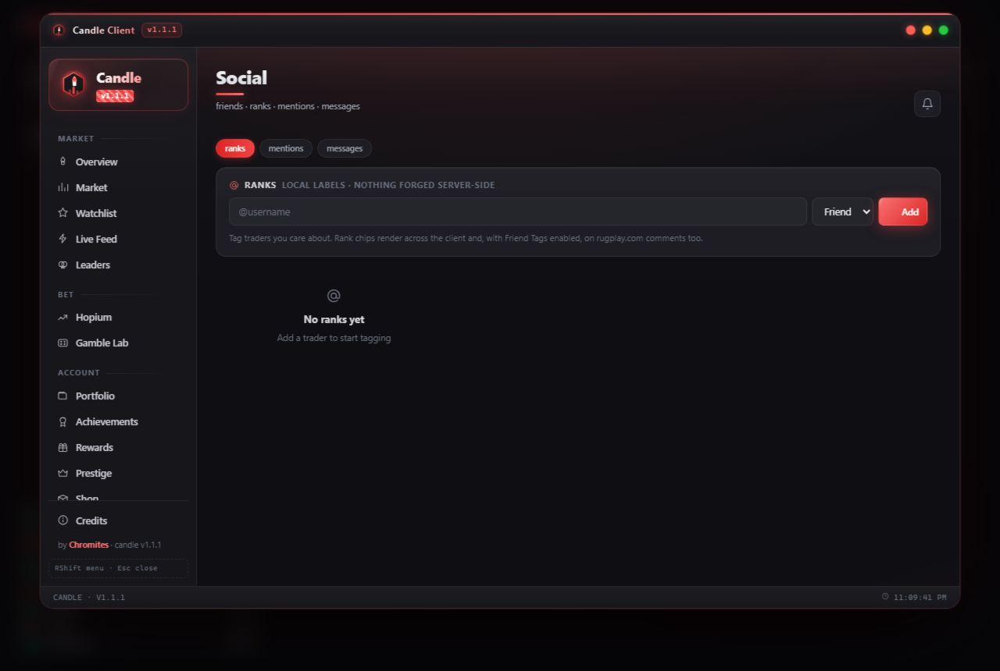
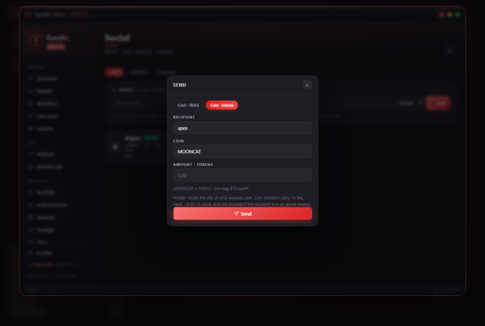
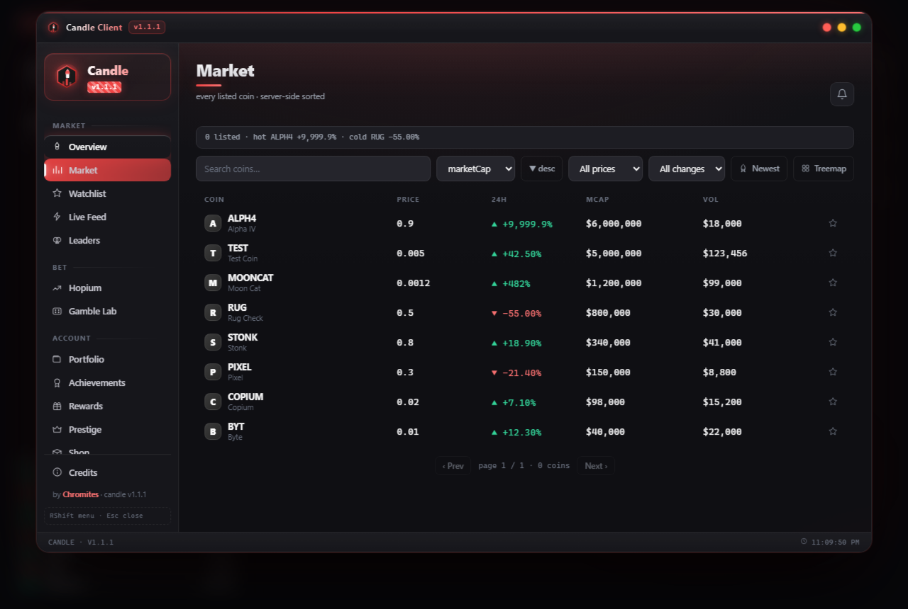
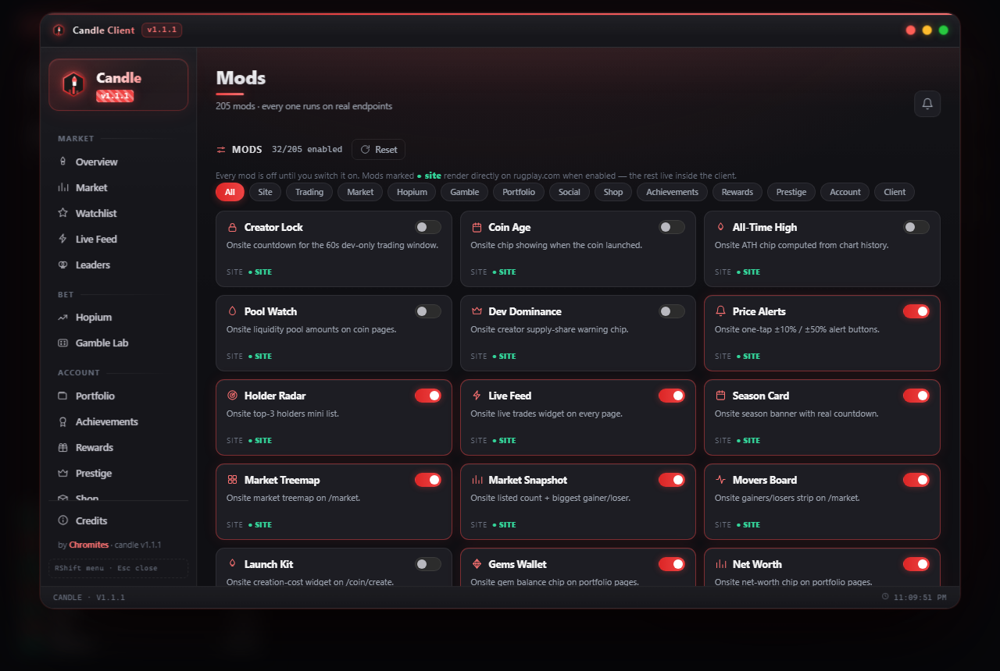

# Candle Client

**A trading terminal for RugPlay. Press Right Shift.**

Candle Client is a Tampermonkey userscript that turns rugplay.com into a proper trading terminal. It floats a full client over the site with market data, trade analytics, a social layer, and 205 mods in 13 categories. Every mod runs on RugPlay's real API and its real platform rules. Nothing in here is mocked, simulated, or fabricated.

Built by Chromites. Version 1.1.1. Free to use.

  
  
  
  
  

## Screenshots

The Social view: ranks, mentions, and messages on real endpoints.

Hidden coin transfers: the site UI only exposes cash, the real endpoint takes coins too.

## Install

1. Install the Tampermonkey extension for your browser.
2. Open Tampermonkey, go to Utilities, and install from the `candle-client.user.js` file in this repo. You can also paste the file into a new script.
3. Open rugplay.com and press Right Shift.

The client opens instantly. All 205 mods start disabled. Turn on the ones you want.

## What the client does

The menu has fifteen views: Overview, Market, Watchlist, Live Feed, Leaders, Hopium, Gamble Lab, Portfolio, Achievements, Rewards, Prestige, Shop, Account, Social, and Mods. It presents like a desktop application, not a userscript. There is a sidebar, a live status bar, notifications, five accent colors, and auto, dark, or light themes.

The Social view adds the platform's real social layer: tag traders as Friend, Whale, Watch, or Rival, read your mention inbox, and message anyone by posting a comment with an @mention. Coin comments are RugPlay's chat, and mentions generate real server notifications.

Transfers go both ways. Cash carries the usual 1% fee; coins move with none. The site never exposes coin transfers, but the endpoint accepts them, so the client sends tokens with live price estimation and a $10 minimum value check, straight from the real rules.

## The mods

Two hundred and five mods, thirteen categories, zero placeholders.

| Category | Mods | What it gives you |
|---|---|---|
| Site | 38 | Widgets rendered directly on rugplay.com. Price, 24h change, market cap, and volume chips on coin pages. Trade tape, hopium, leaderboard, rewards, keys, arcade, season join, mention radar, friend tags, and quick transfer. |
| Trading | 20 | Order flow, average entry, dev watch, break-even price, slippage, quick sell, volatility, x since launch. |
| Market | 20 | Treemap, price and cap distributions, market clock, heat rows, micro and mega cap highlights, trade pace. |
| Hopium | 9 | Hot markets, near resolve, pool spread, bet EV, resolved list. |
| Gamble | 17 | The real EV for dice, coinflip, slots, mines, and tower. An edge gauge and a fairness ranking for every game. |
| Portfolio | 15 | Allocation, biggest hold, transaction summary, average entry, top value. |
| Social | 14 | Name colors, founder badges, profile peek, block from profile, rank tags, mention pings. |
| Shop | 9 | Crate odds and EV from the actual drop weights, gem packages, equip color. |
| Achievements | 11 | Search, difficulty and category filters, progress bars, claim all. |
| Rewards | 7 | The 30 day table, streak math with the real 12h and 36h window, prestige multipliers. |
| Prestige | 5 | The real cost ladder, your plan, multiplier progress. |
| Account | 8 | API key budget, promo codes, data export, username check, block list. |
| Client | 13 | Themes, accent colors, glow, animation, shadows, key hints, status bar. |

## The math is real

Creator lock, the 0.3% swap fee, the 1% transfer fee, house edges for every arcade game, the daily reward ladder from $1,200 to $8,500, and prestige multipliers. All of it is computed the same way the server computes it. You are never guessing.

## Repo layout

- `candle-client.user.js` the entire client in one file, no dependencies
- `build-preview.js` dev tooling that generates a standalone preview page with mock data
- `screens/` the screenshots used in this readme, plus the social preview card
- `CHANGELOG.md` release history
- `CONTRIBUTING.md` how to report bugs and ideas (closed source)

## Spread the word

If the client is working for you, help it reach the people who need it.

- **Discord.** Paste the repo link into any rugplay or meme coin community you are part of.
- **Reddit.** Post a clip or a screenshot with a one line summary. Something like: "Made a free trading client for RugPlay, 205 mods, press Right Shift."
- **X / Twitter.** A 15 second clip of the menu opening beats any description. Tag it with rugplay and tampermonkey.
- **Friends.** The fastest growth is still one player telling another.

A clip of the Right Shift menu opening, one trade executed, and the mods view is the whole pitch in under 20 seconds.

The repo includes a ready-made 1280x640 social card at `screens/social-preview.png`. To make link shares show it, upload the file in **Settings, General, Social preview** (one click, under 1 MB).

## License

Closed source. All rights reserved. Free for personal use on rugplay.com. See LICENSE for the full terms. The short version: use it on your own account, do not repackage or resell it, and do not host copies for download.

## Disclaimer

Candle Client is not affiliated with or endorsed by RugPlay. Every write action in the client, whether a trade, bet, claim, crate, equip, prestige, or transfer, is deliberate and confirmed on your own session. Use it at your own risk.
